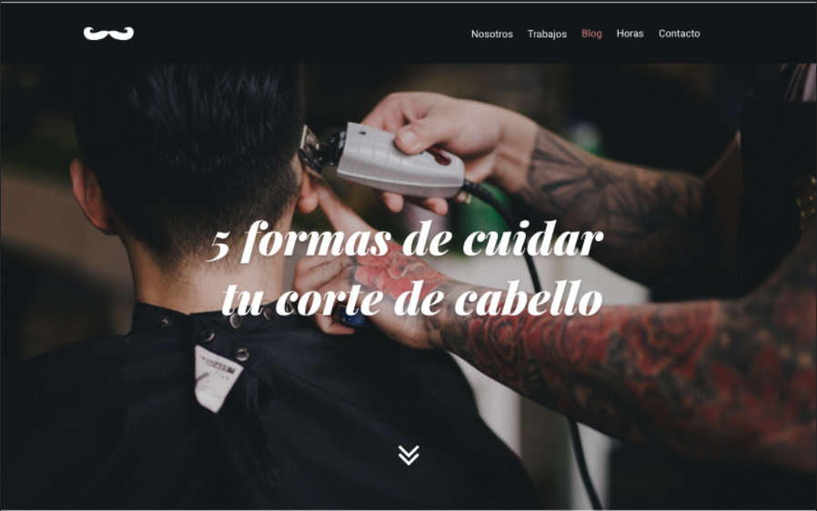

## Desafío Barber Shop




|Bootcamp 2022 Modulo 3|Desarrollo de la interfaz de usuario web|
|----|-----|
|**Unidad 3**|Sass y el patron 7-1|
|**Día Bootcamp**|31|
|**Día Modulo**|9/15|


    Este desafío requiere implementar el flujo aprendido en la unidad, utilizando como base Sass y el patrón 7-1 para representar las maquetas. Además contempla la integración de Bootstrap directamente dentro del esquema 7-1 para utilizar sus componentes en local. 


### NOTAS: 

- La parte más difícil de este desfío ha sido integrar Sass con Bootstrap, en el sentido de saber cuánto Bootstrap utilizar para no llenar el código de elementos innecesarios solo por usar los parciales. Se ha hecho un mejor intento en honor al tiempo pero se observan mejoras posibles. 
- El desafío no requiere la creación de un sitio responsive pero si tiene solicita vistas para viewports de 1280 y 414. Para respetar esto, se ha trabajado con la simulación de los modelos Pixel 2 y Nexus 6, que son los que más parecido tienen al viewport que se estima en la imagen. Esta maqueta no se ha trabajado para viewport 320px porque se considera que el diseño ofrecido no es adecuado para ese tamaño, por ejemplo, los botones del footer alineados o el índice de páginas son prácticamente inutilizables en ese tamaño pero si funcionan a partir de 400px aprox.
- Como este desafío no tiene maquetas "reales", sino solo imágenes png de ellas, se intentó simplemente que la versión para los viewports de 1280 y 414 de ancho sea lo más fiel posible. 
- En un ejercicio de integración de Bootstrap en Sass y modificación de elementos SVG, se ha modificado la siguiente línea de código `l.1135` en `assets\sass\vendors\bootstrap\_variables.scss` para que el botón del navbar sea más similar a la maqueta:

```css
$navbar-dark-toggler-icon-bg: url("data:image/svg+xml,<svg xmlns='http://www.w3.org/2000/svg' viewBox='0 0 30 30'><path stroke='#FFF' stroke-miterlimit='10' stroke-width='4' d='M4 9h25M4 18h25M4 27h25'/></svg>") !default;
```

- Las modificaciones son: 
  1. `stroke='#{navbar-dark-color}` se ha modificado por `#fff` para igualar al color de la maqueta.
  1. `stroke-width='2'` se ha incrementado a `4` para hacer más gruesas las barras del botón.
  1. `d='M4 7h22M4 15h22M4 23h22'` se ha modificado por: `d='M4 9h25M4 18h25M4 27h25'` para que las barras del botón sean más largas y estén más separadas. 

<!--TODO debería colocar toda propiedad font-relativa en _typography?? -->
<!--TODO pedir ayuda al profe para alinear background-img según la maqueta -->